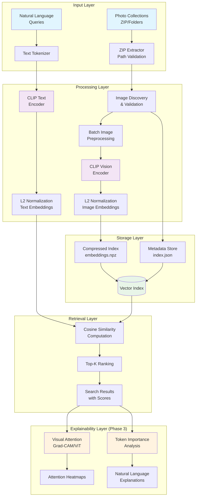
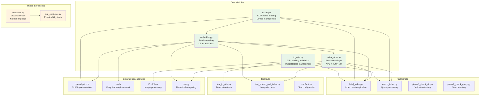
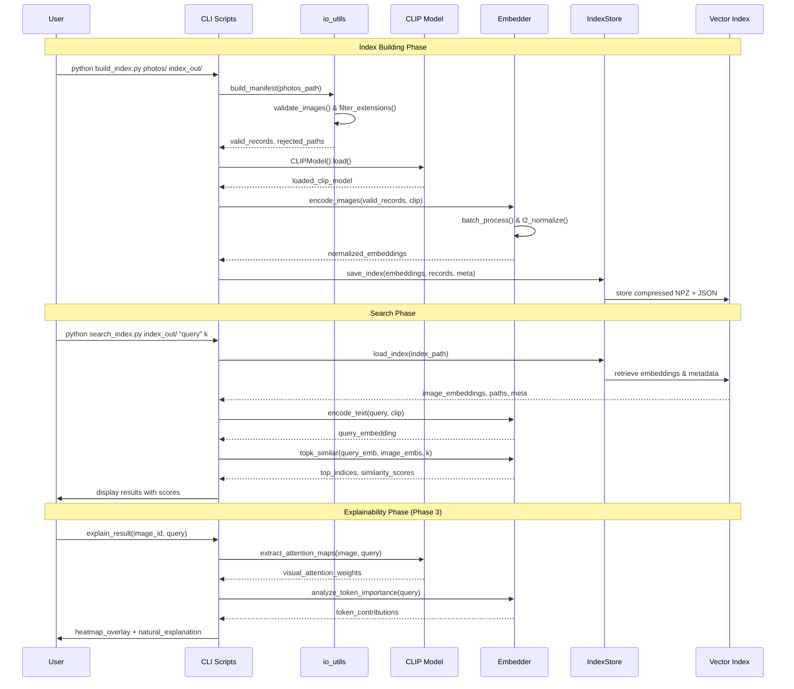
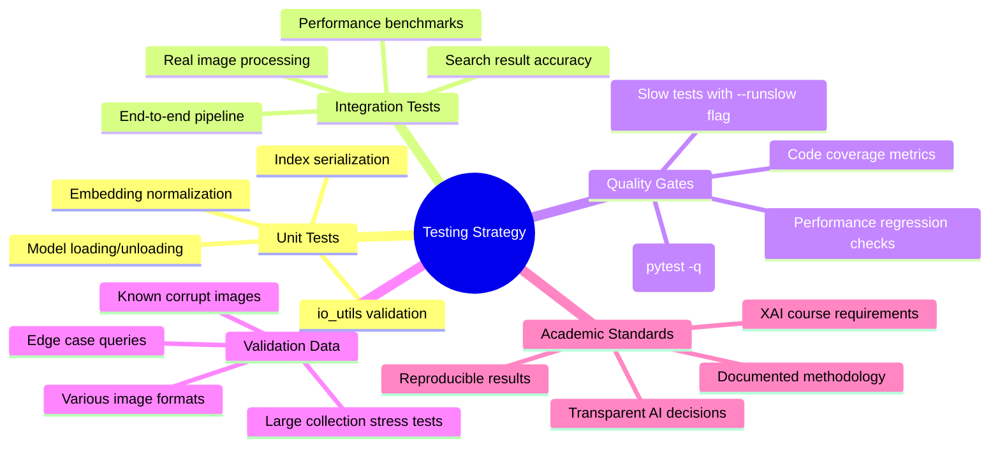
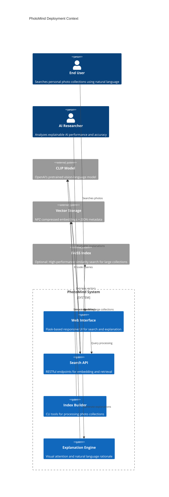

# PhotoMind (CLIPSE-X) Architecture & Methodology Diagrams

## 1. System Architecture Overview



## 2. Data Flow Architecture

```mermaid
flowchart LR
    subgraph "Phase 1: Foundation"
        A1[Raw Images] --> A2[Path Traversal<br/>Protection]
        A2 --> A3[Extension<br/>Filtering]
        A3 --> A4[Pillow.verify()<br/>Validation]
        A4 --> A5[ImageRecord<br/>Manifest]
    end
    
    subgraph "Phase 2: Embeddings & Index"
        A5 --> B1[Batch Loading<br/>RGB Conversion]
        B1 --> B2[CLIP Preprocessing<br/>Transforms]
        B2 --> B3[ViT-B/32 Vision<br/>Encoder Forward Pass]
        B3 --> B4[Feature Extraction<br/>CLS Token]
        B4 --> B5[L2 Normalization<br/>Unit Vectors]
        B5 --> B6[Compressed Storage<br/>NPZ + JSON]
    end
    
    subgraph "Phase 3: Explainability"
        B6 --> C1[Query Processing]
        C1 --> C2[Similarity Matching]
        C2 --> C3[Attention Map<br/>Generation]
        C3 --> C4[Visual Overlay<br/>Heatmaps]
        C2 --> C5[Token Analysis<br/>Importance Weights]
        C5 --> C6[Natural Language<br/>Rationale]
    end
    
    style A1 fill:#ffebee
    style B1 fill:#e3f2fd
    style C1 fill:#f1f8e9
```

## 3. Module Architecture & Dependencies



## 4. Phase-by-Phase Methodology

```mermaid
timeline
    title PhotoMind Development Methodology
    
    section Phase 1: Foundation ✅
        Safe ZIP Extraction    : Path traversal protection
                              : Recursive directory scanning
        Image Discovery       : Extension-based filtering
                              : Pillow validation pipeline
        Manifest Generation   : ImageRecord data structures
                              : Clean/rejected categorization
        Testing Framework     : Pytest configuration
                              : Unit test coverage
    
    section Phase 2: Core AI ✅
        CLIP Integration      : ViT-B/32 model loading
                              : Auto CPU/GPU selection
        Embedding Pipeline    : Batch image processing
                              : L2-normalized features
        Index Persistence     : Compressed NPZ storage
                              : JSON metadata format
        Search Functionality  : Cosine similarity retrieval
                              : Top-k ranking system
    
    section Phase 3: Explainability 🎯
        Visual Attention      : Grad-CAM adaptation for ViT
                              : Attention map extraction
        Query Analysis        : Token importance scoring
                              : Semantic contribution weights
        Natural Explanations  : Template-based rationale
                              : "Why?" result annotation
        UI Integration        : Overlay heatmap rendering
                              : Interactive explanation views
    
    section Phase 4: UX & Feedback 📋
        Web Interface         : Flask responsive design
                              : Real-time search results
        User Feedback         : Thumbs up/down collection
                              : Result relevance scoring
        Analytics Dashboard   : Query performance metrics
                              : Usage pattern analysis
        History & Refinement  : Search session tracking
                              : Query suggestion system
    
    section Phase 5: Production 📋
        Performance Scaling   : Optional FAISS integration
                              : Large collection support
        Incremental Updates   : New photo detection
                              : Delta embedding computation
        Deployment Package    : Docker containerization
                              : Installation documentation
        Academic Presentation : XAI course deliverables
                              : Dr. Anand M evaluation
```

## 5. Technical Implementation Flow



## 6. Quality Assurance & Testing Strategy



## 7. Deployment & Scaling Architecture



---

## Usage Instructions

1. **Copy any diagram section** and paste into Mermaid Live Editor: https://mermaid.live/
2. **Customize styling** by modifying the `style` directives at the end of each diagram
3. **Export formats**: PNG, SVG, PDF available from Mermaid Live Editor
4. **Integration**: These diagrams work in GitHub README, GitLab docs, and most markdown renderers

## Academic Presentation Tips

- Use **Architecture Overview** for system design explanation
- Use **Phase Methodology** timeline for project progression
- Use **Technical Flow** sequence diagram for implementation details
- Use **Testing Strategy** mindmap for quality assurance discussion
- Use **Deployment Context** for scalability and real-world application

Each diagram emphasizes the **explainable AI** aspects that Dr. Anand M expects for the XAI course evaluation.